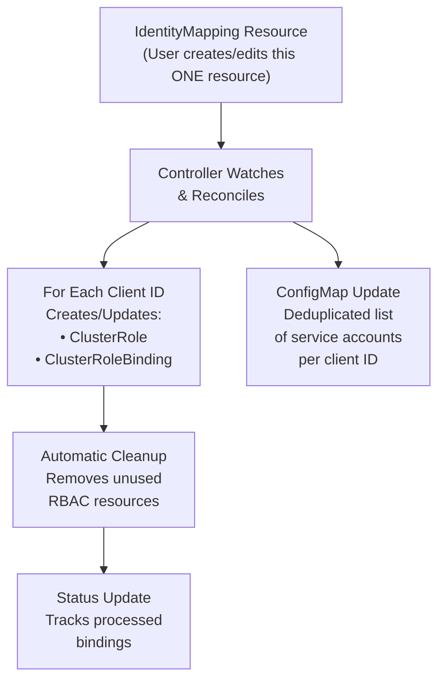

# Identity Binding CRD: Simplifying Azure Identity Management in AKS

## Table of Contents
- [Why We Need This Enhancement](#why-we-need-this-enhancement)
- [The Proposed Solution](#the-proposed-solution)
- [Architecture & Implementation](#architecture--implementation)
- [Getting Started](#getting-started)
- [Troubleshooting](#troubleshooting)

---

## Why We Need This Enhancement

### The Challenge: Manual Identity Binding Configuration

The current user experience of identity bindings requires repetitive configuration on the mapping between service account and user-assigned managed identity. For every identity you wanted to use in your AKS cluster, you had to create and maintain multiple Kubernetes resources by hand.

### Old Manual Workflow (Per Identity Binding)

Here's what users had to do for each unique Azure client ID and service account:

#### 1. Create ClusterRole

```yaml
apiVersion: rbac.authorization.k8s.io/v1
kind: ClusterRole
metadata:
  name: use-ib-23840e71-5ade-4494-8b78-978a8cdb09ed
rules:
- verbs: ["use-managed-identity"]
  apiGroups: ["cid.wi.aks.azure.com"]
  resources: ["23840e71-5ade-4494-8b78-978a8cdb09ed"]  # Must match client ID
```

#### 2. Create ClusterRoleBinding

```yaml
apiVersion: rbac.authorization.k8s.io/v1
kind: ClusterRoleBinding
metadata:
  name: use-ib-23840e71-5ade-4494-8b78-978a8cdb09ed
roleRef:
  apiGroup: rbac.authorization.k8s.io
  kind: ClusterRole
  name: use-ib-23840e71-5ade-4494-8b78-978a8cdb09ed
subjects:
- kind: ServiceAccount
  name: workload-identity-sa # Must match service account name
  namespace: default
```

#### 3. Add annotation to Service Account

```yaml
apiVersion: v1
kind: ServiceAccount
metadata:
  name: workload-identity-sa
  namespace: default
  annotations:
    azure.workload.identity/client-id: "23840e71-5ade-4494-8b78-978a8cdb09ed"  # Must match client ID
```

### Pain Points

- Scattered configuration: Requires configuration across **3 different resources** for each identity binding. Difficult to Scale and Maintain.
- No schema validation: typos or copy-paster-error can only be discovered at runtime. Causing customer incidents.
- Manual conciliation: Users must manually create and clean up dangling resources when service accounts are added, removed or changed.

### Example: Managing 3 Identities

**Old approach required:**
- ✏️ **3 ClusterRole YAML files** (1 per identity)
- ✏️ **3 ClusterRoleBinding YAML files** (1 per identity)
- ✏️ **Manual tracking** of which resources belong together
- ✏️ **Manual cleanup** when changing or removing identities

**Total: 6+ manual YAML files** just to configure 3 identities!

---

## The Proposed Solution

### Introducing: IdentityMapping CRD

The IdentityMapping Custom Resource Definition (CRD) eliminates all manual k8s RBAC configuration by providing a single, declarative interface where you specify only what matters:

> **"Which service account should use which Azure identity?"**

That's it. The controller handles everything else automatically.

### Configuration Comparison

| Configuration Before | Configuration After |
|---------------------|---------------------|
| **Create a Kubernetes namespace to use the KSA:**<br/>`kubectl create namespace NAMESPACE` | **Create a Kubernetes namespace to use the KSA:**<br/>`kubectl create namespace NAMESPACE` |
| **Create the KSA:**<br/>`kubectl create serviceaccount KSA_NAME --namespace NAMESPACE` | **Create the KSA:**<br/>`kubectl create serviceaccount KSA_NAME --namespace NAMESPACE` |
| **Create ClusterRole:**<br/>`kubectl apply -f clusterrole.yaml` | **No longer required** |
| **Create ClusterRoleBinding:**<br/>`kubectl apply -f clusterrolebinding.yaml` | **No longer required** |
| **Annotate Service Account:**<br/>`kubectl annotate serviceaccount KSA_NAME --namespace NAMESPACE azure.workload.identity/client-id="CLIENT_ID"` | **No longer required** |
| **Repeat for each identity** | **Define all mappings in one IdentityMapping resource:**<br/>`kubectl apply -f identity-mapping.yaml` |

### New Simplified Workflow

#### Step 1: Install the CRD and Controller (Managed by AKS)

```bash
# Install the CRD
kubectl apply -f k8s-templates/identity-mapping-crd.yaml

# Deploy the controller
kubectl apply -f k8s-templates/identity-mapping-controller.yaml
```

#### Step 2: Define Your Identity Mappings (One Resource)

```yaml
apiVersion: aks.azure.com/v1alpha1
kind: IdentityMapping
metadata:
  name: default-identity-mappings
spec:
  image-pull:
    # Format: "namespace:serviceaccount": "azure-client-id"
    "default:workload-sa-1": "23840e71-5ade-4494-8b78-978a8cdb09ed"
    "default:workload-sa-2": "23840e71-5ade-4494-8b78-978a8cdb09ed"
    "production:api-service": "23840e71-5ade-4494-8b78-978a8cdb09ed"
    "production:backend-service": "a1b2c3d4-e5f6-7890-abcd-ef1234567890"
    "staging:test-service": "a1b2c3d4-e5f6-7890-abcd-ef1234567890"
```

#### Step 3: Apply and Done! ✅

```bash
kubectl apply -f identity-mappings.yaml
```

**The controller automatically creates:**
- ✅ ClusterRoles (one per unique client ID)
- ✅ ClusterRoleBindings (one per unique client ID)
- ✅ ConfigMap with deduplicated service account lists， used by credential providers when exchanging tokens
- ✅ Status tracking and reconciliation

### Benefits

| Old Approach | New CRD Approach |
|-------------|------------------|
| 13+ manual YAML files for 3 identities | **1 YAML file** for all identities |
| Manual cleanup required | **Automatic cleanup** |
| No status tracking | **Status subresource** with reconciliation state |
| Imperative operations | **Fully declarative** |
| Error-prone copy-paste | **Type-safe schema** |
| Scattered configuration | **Single source of truth** |

### What The Controller Automates



---

## Architecture & Implementation

### System Components

#### 1. **IdentityMapping CRD**

**Purpose**: Declarative API for identity bindings

**Resource Specification**:
```yaml
apiVersion: aks.azure.com/v1alpha1
kind: IdentityMapping
metadata:
  name: default-identity-mappings
spec:
  image-pull:
    # Map of service account -> client ID
    "<namespace>:<serviceaccount>": "<azure-client-id>"
status:
  conditions:
  - type: Ready
    status: "True"
    lastTransitionTime: "2025-12-09T10:00:00Z"
    reason: Reconciled
    message: "Successfully processed 5 bindings"
  processedBindings:
    "default:workload-sa-1": "23840e71-5ade-4494-8b78-978a8cdb09ed"
```

**Key Features**:
- **Cluster-scoped**: One resource can manage all identities
- **Pattern validation**: Ensures `namespace:name` format via regex
- **Status subresource**: Tracks reconciliation state
- **Short name**: `im` (e.g., `kubectl get im`)

#### 2. **Identity Mapping Controller**

**Purpose**: Kubernetes operator that reconciles IdentityMapping resources

**Implementation**:
- **Language**: Shell script (bash)
- **Deployment**: Single replica in `kube-system` namespace
- **Dependencies**: kubectl, jq
- **Reconciliation**: Watches IdentityMapping resources and automatically creates/updates ClusterRoles, ClusterRoleBindings, and ConfigMap based on the service account to client ID mappings.

#### 3. **ConfigMap: acr-identity-binding-mappings**

**Purpose**: Stores the mapping that credential providers read

**Location**: `kube-system` namespace

#### 4. **Per-Client-ID RBAC Resources**

**Created Automatically**: ClusterRole + ClusterRoleBinding for each unique client ID

**Naming Convention**: `ib-exchange-{clientId}`

### Key Controller Features

The controller provides automatic management with these features:

1. **Schema-level validation**: CRD validates `namespace:name` format with regex patterns
2. **Uniqueness enforcement**: Only one IdentityMapping resource per cluster
3. **Grouping by client ID**: Controller remaps bindings from `sa->clientId` to `clientId->[sa,sa,...]`
4. **Separate reconciliation modes**:
   - CREATE: Full reconciliation of all bindings
   - MODIFY: Incremental updates with automatic cleanup
   - DELETE: Removes all managed RBAC resources
5. **Optimized processing**: Single resource read per reconciliation, in-memory remapping

---

## Troubleshooting

### Common Issues and Solutions

#### Issue 1: Controller Not Creating RBAC

**Symptoms**:
```bash
kubectl get clusterrole -l app=identity-mapping-controller
# No resources found
```

**Debugging Steps**:

1. Check controller is running:
```bash
kubectl get pods -n kube-system -l app=identity-mapping-controller
```

2. Check controller logs:
```bash
kubectl logs -n kube-system -l app=identity-mapping-controller --tail=50
```

3. Verify CRD is installed:
```bash
kubectl get crd identitymappings.aks.azure.com
```

4. Check IdentityMapping resource exists:
```bash
kubectl get identitymapping
```

**Solution**: Ensure controller has proper RBAC permissions:
```bash
kubectl get clusterrole identity-mapping-controller-role
kubectl get clusterrolebinding identity-mapping-controller-binding
```

#### Issue 2: ConfigMap Not Updated

**Symptoms**:
```bash
kubectl get configmap acr-identity-binding-mappings -n kube-system -o yaml
# Data is empty or outdated
```

**Debugging Steps**:

1. Check controller logs for errors:
```bash
kubectl logs -n kube-system -l app=identity-mapping-controller | grep -i error
```

2. Verify IdentityMapping has bindings:
```bash
kubectl get identitymapping default-identity-mappings -o jsonpath='{.spec.bindings}'
```

3. Force reconciliation by editing the resource:
```bash
kubectl annotate identitymapping default-identity-mappings reconcile="$(date +%s)"
```

#### Issue 3: Invalid Service Account Format

**Symptoms**:
```bash
kubectl apply -f identity-mapping.yaml
# Error: validation failed
```

**Cause**: Service account key doesn't match `namespace:name` format

**Solution**: Ensure proper format:
```yaml
# ✅ Correct
"default:my-app-sa": "client-id"
"production:backend-service": "client-id"

# ❌ Wrong
"my-app-sa": "client-id"  # Missing namespace
"default/my-app": "client-id"  # Wrong separator
"DEFAULT:app": "client-id"  # Uppercase not allowed
```

#### Issue 4: Duplicate Service Accounts

**Symptoms**: Multiple entries for same service account

**Debugging**:
```bash
kubectl get configmap acr-identity-binding-mappings -n kube-system -o jsonpath='{.data}' | jq
```

**Cause**: Service account mapped to multiple client IDs in IdentityMapping

**Solution**: Each service account should map to only ONE client ID:
```yaml
# ✅ Correct
spec:
  bindings:
    "default:app-sa": "client-id-123"
    
# ❌ Wrong (will cause issues)
spec:
  bindings:
    "default:app-sa": "client-id-123"
    "default:app-sa": "client-id-456"  # Duplicate key
```

#### Issue 5: Old RBAC Not Cleaned Up

**Symptoms**: Extra ClusterRoles/ClusterRoleBindings exist

**Debugging**:
```bash
# List all
kubectl get clusterrole | grep ib-exchange
kubectl get clusterrolebinding | grep ib-exchange

# Check labels
kubectl get clusterrole ib-exchange-{client-id} -o jsonpath='{.metadata.labels}'
```

**Solution**: If resources lack the controller label, delete manually:
```bash
kubectl delete clusterrole ib-exchange-{old-client-id}
kubectl delete clusterrolebinding ib-exchange-{old-client-id}
```

### Diagnostic Commands

```bash
# Check overall health
kubectl get identitymapping
kubectl get pods -n kube-system -l app=identity-mapping-controller
kubectl get configmap acr-identity-binding-mappings -n kube-system

# View detailed status
kubectl describe identitymapping default-identity-mappings

# Check controller logs
kubectl logs -n kube-system -l app=identity-mapping-controller --tail=100

# List all RBAC created by controller
kubectl get clusterrole,clusterrolebinding -l app=identity-mapping-controller

# Verify service account bindings
kubectl get identitymapping default-identity-mappings \
  -o jsonpath='{.status.processedBindings}' | jq
```

### Getting Help

If you encounter issues not covered here:

1. **Collect diagnostic information**:
```bash
# Save to file for sharing
kubectl get identitymapping -o yaml > identity-mappings.yaml
kubectl get configmap acr-identity-binding-mappings -n kube-system -o yaml > configmap.yaml
kubectl logs -n kube-system -l app=identity-mapping-controller --tail=200 > controller-logs.txt
kubectl get clusterrole,clusterrolebinding -l app=identity-mapping-controller > rbac-resources.txt
```

2. **Check controller logs** for specific error messages
3. **Verify Azure identity binding** is properly configured
4. **Test with a simple example** to isolate the issue

---

## Summary

The IdentityMapping CRD transforms Azure identity management in AKS from a manual, error-prone process into a simple, declarative workflow:

| Aspect | Before (Manual) | After (CRD) |
|--------|-----------------|-------------|
| **Configuration** | 13+ YAML files | 1 YAML file |
| **Maintenance** | Manual editing | Automatic reconciliation |
| **Validation** | None | Built-in regex validation |
| **Deduplication** | Manual | Automatic |
| **Cleanup** | Manual deletion | Automatic garbage collection |
| **Observability** | None | Status tracking |
| **Error Rate** | High (copy-paste) | Low (schema validation) |

### Key Takeaways

1. **Focus on what matters**: Just specify "which service account uses which identity"
2. **Let automation handle the rest**: Controller manages all RBAC and ConfigMap updates
3. **Declarative by design**: Edit one resource, reconciliation happens automatically
4. **Built-in safety**: Validation, deduplication, and status tracking prevent errors
5. **Easy to maintain**: Add/remove bindings with simple edits

**Start simple, scale confidently** — the IdentityMapping CRD grows with your needs from a single identity to hundreds, all managed through one declarative resource.
